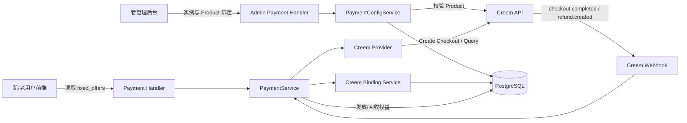
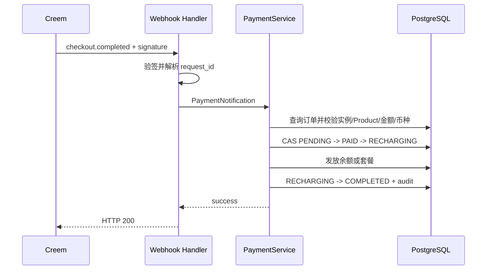

# Creem 支付接入与新前端 Stripe 跳转修复技术方案

> 状态：已确认，可进入实施计划与开发阶段
> 日期：2026-07-13
> 目标仓库：`/Users/fatballfish/Documents/Projects/GoProjects/Personal/sub2api`
> 参考实现：`/Users/fatballfish/Documents/Projects/GoProjects/Public/new-api`
> 官方文档：[Creem Introduction](https://docs.creem.io/getting-started/introduction)、[Checkout API](https://docs.creem.io/features/checkout/checkout-api)、[Webhooks](https://docs.creem.io/code/webhooks)、[Refunds and Cancellations](https://docs.creem.io/features/subscriptions/refunds-and-cancellations)

## 0. 方案结论

在 sub2api 现有统一支付架构中新增 `creem` Provider，并新增结构化的 Creem Product 绑定模型。Creem 下单、订单、支付成功、权益发放和退款状态复用现有 `PaymentService`，不复制 new-api 的独立充值 controller。

本期契约如下：

1. Creem 仅允许绑定 `billing_type=onetime` 且 `status=active` 的 Product。
2. Creem 余额充值只能选择后台配置的固定档位，禁止自定义金额。
3. Creem 支持余额、普通套餐和全局套餐首次购买；不支持动态金额的全局套餐升级。
4. Product ID 只由后台配置，用户端只提交不透明的 `offer_id`。
5. Creem 实例的“允许退款”和“允许用户自主退款”始终为关闭状态，后端拒绝开启。
6. 管理员在 Creem Dashboard 发起全额或部分退款；sub2api 始终接收并处理 `refund.created`，不受退款开关影响。
7. Creem 公共 OpenAPI 和官方 TypeScript SDK 当前未提供创建退款操作，因此本期不虚构出站退款 API；保留后续 Provider 扩展点。
8. 新前端 Stripe 修复沿用现有 PaymentIntent + Payment Element 模式，补齐 `client_secret` 分支和内部支付页，不切换为 Stripe Checkout Session。

## 一、需求描述

### 1.1 背景与目标

sub2api 已支持支付宝、微信、EasyPay、Stripe、Airwallex、Jeepay 等支付 Provider，具有统一的订单、回调、权益发放、审计和退款链路。Creem 与上述动态金额渠道不同：Checkout 必须引用提前创建且已定价的 Product。因此需要在不破坏现有支付方式的前提下引入“固定商品支付”能力。

预期效果：

- 管理员可在老后台配置 Creem 凭据及多个 Product 绑定。
- 用户在新老前端可清晰切换 Creem 固定档位模式和其他渠道的自由金额模式。
- 未绑定、失效、价格不一致或非一次性的 Product 无法支付。
- Creem 支付成功后继续使用现有余额、普通套餐、全局套餐发放逻辑。
- Creem Dashboard 中发生退款后，sub2api 可幂等同步订单状态并强制回收对应权益。
- 新前端 Stripe 创建订单后能自动进入可完成支付的页面。

### 1.2 功能范围与优先级

| 优先级 | 子目标 | 交付标准 |
|---|---|---|
| P0 | Creem Provider | Checkout 创建、主动查单、Webhook 验签和支付完成映射可用 |
| P0 | Product 绑定 | 支持余额、普通套餐、全局套餐；强制校验 active + onetime |
| P0 | 服务端金额防篡改 | 金额、币种、Product、目标类型完全由绑定和套餐推导 |
| P0 | 双前端用户支付 | Creem 固定档位与其他渠道自由金额互斥切换 |
| P0 | 入站退款 | `refund.created` 全额/部分退款、幂等、权益回收、审计 |
| P0 | 老后台配置 | Creem 实例与多个 Product 的增删改查、同步和健康状态 |
| P0 | Stripe 新前端修复 | `client_secret` 自动进入 Payment Element 支付页 |
| P1 | 异常退款重试 | 后台查看和重试未成功应用的 Creem 退款事件 |
| P1 | Dispute 回收 | `dispute.created` 按强制全额退款处理并告警 |
| P2 | Creem 出站退款 | Creem 发布并确认稳定退款 API 后接入统一 Provider.Refund |

### 1.3 非目标

- 不支持 Creem recurring Product、自动续费、取消订阅和欠费重试。
- 不支持 Creem 自定义余额金额。
- 不支持 Creem 全局套餐按比例升级订单。
- 不在本期抽象全渠道通用商品中心。
- 不允许管理员配置任意 Creem API Base URL，避免 SSRF 和凭据外送。
- 不以成功页跳转作为入账依据，权益发放只依赖已验签 Webhook 或可信主动查单。

### 1.4 角色

| 角色 | 职责 |
|---|---|
| 管理员 | 配置 Creem 实例、绑定 Product、在 Creem Dashboard 发起退款、重试异常事件 |
| 普通用户 | 选择固定余额档位或已支持 Creem 的套餐并完成支付 |
| sub2api | 生成订单、验证外部事实、发放或回收权益、记录审计 |
| Creem | 托管 Checkout、收款、退款并发送 Webhook |

## 二、现状分析与技术选型

### 2.1 sub2api 可复用能力

| 能力 | 现有位置 | 复用方式 |
|---|---|---|
| Provider 抽象 | `backend/internal/payment/types.go` | 新增 `TypeCreem` 和 Provider 实现 |
| Provider 工厂 | `backend/internal/payment/provider/factory.go` | 支持从历史实例快照重建 Creem Provider |
| 实例配置 | `payment_provider_instances` | 保存 API Key、Webhook Secret、环境和启用状态 |
| 统一订单 | `payment_orders` | 保存 Creem 订单及 Product 快照 |
| 订单创建 | `backend/internal/service/payment_order.go` | 增加固定 Offer 分支，继续使用统一订单事务 |
| 支付完成 | `backend/internal/service/payment_fulfillment.go` | 继续发放余额、普通套餐、全局套餐 |
| 退款回收 | `backend/internal/service/payment_refund.go` | 复用权益调整原语，新增外部退款事实入口 |
| Webhook 路由 | `backend/internal/handler/payment_webhook_handler.go` | 新增 Creem 路由、验签和事件分流 |
| 老前端支付 | `frontend/src/views/user/PaymentView.vue` | 增加固定 Offer 模式 |
| 新前端支付 | `frontend-new/src/pages/console/Billing.tsx` | 增加固定 Offer 模式和 Stripe client_secret 分支 |

### 2.2 new-api 参考结论

new-api 已验证以下基础契约：

- `POST /v1/checkouts` 接受 `product_id`、`request_id`、`customer.email`、`metadata`。
- 测试和生产分别使用 `https://test-api.creem.io` 与 `https://api.creem.io`。
- `checkout.completed` 可用 `object.request_id` 关联本地订单。
- `creem-signature` 是对原始 Body 使用 Webhook Secret 计算的 HMAC-SHA256 十六进制值。

不直接照搬的部分：

- new-api 使用 JSON 字符串保存余额 Product，缺少关系约束和实例隔离。
- new-api 将 Creem 逻辑放在独立 controller，未复用 sub2api 的 Provider、退款和审计体系。
- new-api 当前只处理 `checkout.completed`，没有业务退款同步实现。
- new-api 的 Product 名称、价格、币种由管理员手填，存在与 Creem 实际 Product 漂移的风险。

### 2.3 官方能力结论

截至 2026-07-13：

- Product 查询：`GET /v1/products?product_id=...`。
- Checkout 创建：`POST /v1/checkouts`。
- Checkout 查询：`GET /v1/checkouts?checkout_id=...`。
- Product 价格为 minor unit；`1000` 表示 `10.00`。
- Product `billing_type` 为 `onetime` 或 `recurring`。
- Webhook 失败后按 30 秒、1 分钟、5 分钟、1 小时退避重试。
- 退款支持 Dashboard 中的全额和部分退款，并发送 `refund.created`。
- `refund.created.object.refund_amount` 和 `transaction.amount_paid` 均为含税实际资金的 minor unit，可用于计算退款比例。
- 公共 OpenAPI 和官方 SDK 没有创建退款 operation。实现前不得猜测 URL 或请求体。

### 2.4 方案对比

| 维度 | A：复制 new-api JSON | B：Creem 绑定表 + 统一支付 | C：通用商品中心 |
|---|---|---|---|
| 实现复杂度 | 低 | 中 | 高 |
| 数据一致性 | 低 | 高 | 高 |
| 多实例隔离 | 弱 | 强 | 强 |
| 退款与审计 | 需重复实现 | 复用现有能力 | 需大范围重构 |
| 后续维护 | 高风险 | 可控 | 当前成本过高 |
| 结论 | 不采用 | **采用** | 暂不采用 |

## 三、整体架构



关键分层：

- Provider 只理解 Creem HTTP、签名和外部 DTO，不查询业务表。
- Binding Service 只管理 Product 与业务目标关系及健康状态。
- PaymentService 是金额推导、订单状态和权益变更的唯一业务入口。
- 前端只消费服务端 Offer，不推导 ProductID 或可信金额。

## 四、数据结构设计

### 4.1 `creem_product_bindings`

新增 Ent Schema：`backend/ent/schema/creem_product_binding.go`。

| 字段 | 类型 | 约束/说明 |
|---|---|---|
| `id` | bigint | Ent 主键 |
| `provider_instance_id` | bigint | 必须指向 `provider_key=creem` 的实例 |
| `external_product_id` | varchar(128) | Creem Product ID |
| `target_type` | varchar(20) | `balance`、`group_plan`、`global_plan` |
| `plan_id` | bigint nullable | 套餐目标必填，余额目标为空 |
| `credited_balance` | decimal(20,2) nullable | 余额到账额度；套餐为空 |
| `product_name` | varchar(255) | 从 Creem 同步 |
| `price_minor` | bigint | Product 基础价格 minor unit |
| `currency` | varchar(3) | ISO 4217 大写 |
| `billing_type` | varchar(20) | 本期只能为 `onetime` |
| `product_status` | varchar(20) | 必须为 `active` 才可支付 |
| `tax_mode` | varchar(20) | `inclusive` 或 `exclusive` |
| `environment` | varchar(10) | `test` 或 `prod` |
| `enabled` | boolean | 管理员开关，默认 true |
| `health_status` | varchar(20) | `healthy`、`stale`、`invalid` |
| `health_reason` | text | 最近校验失败原因 |
| `sort_order` | int | 用户端排序 |
| `last_synced_at` | timestamptz | 最近成功同步时间 |
| `created_at` | timestamptz | 创建时间 |
| `updated_at` | timestamptz | 更新时间 |

索引和约束：

```text
uk_creem_binding_instance_product(provider_instance_id, external_product_id)
uk_creem_binding_instance_target(provider_instance_id, target_type, plan_id)
idx_creem_binding_target(target_type, plan_id, enabled)
idx_creem_binding_instance(provider_instance_id, enabled)
```

第二个唯一约束对 `plan_id IS NULL` 的余额行不限制多档商品；余额重复档位由服务层按 `credited_balance + currency + price_minor` 阻止。PostgreSQL migration 使用 partial unique index 约束套餐行。

### 4.2 `creem_refund_events`

新增 Ent Schema：`backend/ent/schema/creem_refund_event.go`。

| 字段 | 类型 | 说明 |
|---|---|---|
| `id` | bigint | 主键 |
| `event_id` | varchar(128) unique | Creem Webhook Event ID |
| `provider_refund_id` | varchar(128) unique | `ref_xxx` |
| `provider_instance_id` | bigint | 验签所用实例 |
| `payment_order_id` | bigint nullable | 本地订单 |
| `transaction_id` | varchar(128) | Creem transaction ID |
| `refund_amount_minor` | bigint | 本次退款含税金额 |
| `cumulative_refunded_minor` | bigint | Creem transaction 累计退款金额 |
| `transaction_amount_paid_minor` | bigint | 原交易含税实付金额 |
| `currency` | varchar(3) | 退款币种 |
| `refund_ratio` | decimal(12,10) | 累计退款比例 |
| `status` | varchar(20) | `received`、`processing`、`applied`、`failed`、`ignored` |
| `recovery_snapshot` | jsonb | 已回收余额、天数、前后状态 |
| `raw_payload` | jsonb | 完整事件，用于审计和重试 |
| `attempts` | int | 处理次数 |
| `last_error` | text | 最近错误 |
| `processed_at` | timestamptz nullable | 成功时间 |
| `created_at/updated_at` | timestamptz | 时间 |

### 4.3 订单快照

不新增 `payment_orders` 列，使用已有 JSON 快照保持滚动升级兼容。

`provider_snapshot` schema_version 升至 3，Creem 增加：

```json
{
  "schema_version": 3,
  "provider_key": "creem",
  "provider_instance_id": "8",
  "creem_binding_id": 12,
  "creem_product_id": "prod_xxx",
  "creem_checkout_id": "ch_xxx",
  "product_price_minor": 2000,
  "product_currency": "USD",
  "product_tax_mode": "exclusive",
  "target_type": "balance",
  "credited_balance": 25
}
```

`refund_snapshot` 增加：

```json
{
  "provider_amount_paid_minor": 2420,
  "provider_cumulative_refunded_minor": 1210,
  "external_refund_ratio": 0.5,
  "external_recovered_balance": 12.5,
  "external_recovered_days": 0
}
```

### 4.4 金额精度

- Creem 外部资金一律使用 `int64 minor unit`。
- 只有 API 展示和写入现有订单 decimal 字段时转换为 major unit。
- 币种小数位复用 `backend/internal/payment/currency.go`。
- 比例计算使用十进制定点或 `big.Rat`，最终余额按钱包精度四舍五入，天数向上取整。
- `transaction.amount_paid` 作为退款比例分母；Product 基础价格和支付成功金额校验使用 `order.amount`，避免税外加模式误报。

## 五、Provider 与配置设计

### 5.1 Provider 配置

```json
{
  "apiKey": "creem_xxx",
  "webhookSecret": "whsec_xxx",
  "environment": "test"
}
```

- `apiKey`、`webhookSecret` 加入敏感字段表，GET 管理接口只返回掩码。
- `environment=test` 固定使用 `https://test-api.creem.io/v1`。
- `environment=prod` 固定使用 `https://api.creem.io/v1`。
- 不接受 `apiBase`，避免 SSRF。
- `supported_types` 固定规范化为 `["creem"]`。
- 创建和更新 Creem 实例时，无论请求值为何，都将 `refund_enabled` 和 `allow_user_refund` 保存为 false。

### 5.2 Provider 接口映射

在 `backend/internal/payment/types.go` 增加：

```go
const TypeCreem PaymentType = "creem"

type CreatePaymentRequest struct {
    // existing fields...
    ProductID     string
    CustomerEmail string
    Metadata      map[string]string
}
```

Creem Provider 行为：

| 方法 | 行为 |
|---|---|
| `Name` | `Creem` |
| `ProviderKey` | `creem` |
| `SupportedTypes` | `[creem]` |
| `CreatePayment` | 创建 Checkout，返回 `TradeNo=checkout.id`、`PayURL=checkout.checkout_url` |
| `QueryOrder` | 按 checkout ID 查询并映射 pending/paid/failed/refunded |
| `VerifyNotification` | 验签并解析支付或退款事件 |
| `Refund` | 返回明确的 `CREEM_OUTBOUND_REFUND_UNSUPPORTED`，不会调用未知 API |

HTTP 契约：

```go
client.Timeout = 15 * time.Second
headers["x-api-key"] = apiKey
headers["Content-Type"] = "application/json"
```

Checkout 请求：

```json
{
  "product_id": "prod_xxx",
  "request_id": "20260713...",
  "success_url": "https://host/payment/result?resume_token=...",
  "customer": {"email": "user@example.com"},
  "metadata": {
    "sub2api_order_id": "123",
    "sub2api_out_trade_no": "20260713...",
    "creem_binding_id": "12"
  }
}
```

不对创建 Checkout 自动重试。网络超时可能发生“上游已创建、本地未知”，自动重试可能生成多个 Checkout；订单标记 `FAILED` 前记录错误，用户重试创建新本地订单，旧 Checkout 即使付款仍能通过 `request_id` 找回原订单。

## 六、Product 绑定管理

### 6.1 管理接口

在现有管理员鉴权与合规 Guard 下新增：

| 方法 | 路径 | 用途 |
|---|---|---|
| GET | `/api/v1/admin/payment/providers/:id/creem-products` | 列表 |
| POST | `/api/v1/admin/payment/providers/:id/creem-products` | 查询 Creem Product、校验并创建绑定 |
| PUT | `/api/v1/admin/payment/providers/:id/creem-products/:binding_id` | 修改目标、到账额度、启用和排序 |
| DELETE | `/api/v1/admin/payment/providers/:id/creem-products/:binding_id` | 删除无进行中订单引用的绑定 |
| POST | `/api/v1/admin/payment/providers/:id/creem-products/:binding_id/sync` | 从 Creem 重新同步并更新健康状态 |
| POST | `/api/v1/admin/payment/creem-refunds/:event_id/retry` | 重试失败的外部退款事件 |

创建请求：

```json
{
  "product_id": "prod_xxx",
  "target_type": "balance",
  "plan_id": null,
  "credited_balance": 25,
  "enabled": true,
  "sort_order": 10
}
```

### 6.2 绑定校验伪代码

```go
func ValidateAndBind(req BindRequest, instance ProviderInstance) Binding {
    require(instance.ProviderKey == "creem")
    product := creem.GetProduct(req.ProductID)
    require(product.Mode == instance.Environment)
    require(product.Status == "active")
    require(product.BillingType == "onetime")
    require(validCurrency(product.Currency))
    require(product.Price >= 0)

    switch req.TargetType {
    case "balance":
        require(req.PlanID == nil)
        require(req.CreditedBalance > 0)
    case "group_plan", "global_plan":
        require(req.CreditedBalance == nil)
        plan := loadForSalePlan(req.PlanID)
        require(scopeMatches(req.TargetType, plan.PlanScope))
        expected := calculatePlanProviderAmount(plan, product.Currency)
        require(expectedMinor == product.Price)
    default:
        reject("CREEM_TARGET_INVALID")
    }
    return snapshotTrustedProductFields(product, req)
}
```

套餐、汇率或全局手续费更新后不批量调用 Creem。读取管理列表和用户 Offer 时重新计算兼容性；不匹配的绑定返回 `health_status=stale` 且不下发给用户。管理员手动同步后恢复。

## 七、用户接口与订单创建契约

### 7.1 Checkout 信息

扩展 `GET /api/v1/payment/checkout-info`：

```json
{
  "methods": {
    "stripe": {"available": true, "amount_mode": "arbitrary"},
    "creem": {
      "available": true,
      "amount_mode": "fixed_product",
      "supported_order_types": ["balance", "subscription", "global_plan"]
    }
  },
  "fixed_offers": [
    {
      "offer_id": 12,
      "payment_type": "creem",
      "target_type": "balance",
      "plan_id": null,
      "title": "Starter Credits",
      "pay_amount": 20,
      "payment_currency": "USD",
      "credited_amount": 25,
      "tax_mode": "exclusive",
      "sort_order": 10
    },
    {
      "offer_id": 13,
      "payment_type": "creem",
      "target_type": "global_plan",
      "plan_id": 8,
      "title": "Pro Monthly",
      "pay_amount": 49,
      "payment_currency": "USD",
      "credited_amount": null,
      "tax_mode": "inclusive",
      "sort_order": 20
    }
  ]
}
```

只返回满足以下全部条件的 Offer：实例启用、Creem 在全局 enabled types 中、绑定启用、健康、Product active + onetime、套餐在售且价格仍匹配、目标对当前用户可见。

### 7.2 创建订单

扩展现有请求：

```json
POST /api/v1/payment/orders
{
  "payment_type": "creem",
  "order_type": "balance",
  "offer_id": 12,
  "amount": 25,
  "return_url": "https://host/payment/result"
}
```

规则：

```go
if req.PaymentType == payment.TypeCreem {
    require(req.OfferID > 0)
    offer := loadAvailableOfferForUser(req.OfferID, req.UserID)
    require(targetMatchesRequest(offer, req.OrderType, req.PlanID))
    require(req.OrderType != payment.OrderTypeGlobalPlanUpgrade)

    if offer.TargetType == "balance" {
        require(equalMoney(req.Amount, offer.CreditedBalance))
        order.Amount = offer.CreditedBalance
    } else {
        require(req.PlanID == offer.PlanID)
        order.Amount = currentPlan.Price
    }
    order.PayAmount = minorToMajor(offer.PriceMinor, offer.Currency)
    order.FeeRate = 0
    pinProviderInstance(offer.ProviderInstanceID)
} else {
    require(req.OfferID == 0)
    existingArbitraryAmountFlow()
}
```

Creem 不进入普通支付负载均衡。一个 Offer 已绑定具体商户实例和 Product；这避免在多实例间选择到不存在对应 Product 的实例。多个实例需要分别配置 Offer。

余额订单仍执行：最大 pending 数、每日额度、余额充值总开关。单笔 min/max 对 Creem 按 `credited_balance` 校验；充值倍率不再二次应用，因为绑定已显式定义到账额度。

### 7.3 响应

沿用统一响应：

```json
{
  "order_id": 123,
  "out_trade_no": "20260713...",
  "payment_type": "creem",
  "pay_url": "https://checkout.creem.io/ch_xxx",
  "amount": 25,
  "pay_amount": 20,
  "amount_currency": "USD",
  "payment_currency": "USD",
  "fee_rate": 0,
  "result_type": "order_created",
  "expires_at": "2026-07-13T12:30:00Z",
  "resume_token": "..."
}
```

### 7.4 错误码

| 错误码 | HTTP | 含义 |
|---|---:|---|
| `CREEM_OFFER_REQUIRED` | 400 | Creem 缺少 offer_id |
| `CREEM_OFFER_NOT_FOUND` | 404 | 不存在或对用户不可见 |
| `CREEM_TARGET_MISMATCH` | 400 | Offer 与订单类型或套餐不匹配 |
| `CREEM_CUSTOM_AMOUNT_UNSUPPORTED` | 400 | 客户端金额与固定 Offer 不一致 |
| `CREEM_PRODUCT_NOT_ONETIME` | 400 | Product 不是一次性 |
| `CREEM_PRODUCT_INACTIVE` | 409 | Product 已归档 |
| `CREEM_PRODUCT_STALE` | 409 | 绑定信息过期或价格不匹配 |
| `CREEM_GLOBAL_UPGRADE_UNSUPPORTED` | 400 | Creem 不支持动态升级价 |
| `CREEM_CHECKOUT_FAILED` | 502 | Creem Checkout 创建失败 |
| `CREEM_OUTBOUND_REFUND_UNSUPPORTED` | 409 | 本期不支持从 sub2api 主动退款 |

## 八、支付回调与状态机

### 8.1 Webhook 路由

新增：`POST /api/v1/payment/webhook/creem`。

处理顺序：

1. 限制 Body 为 1 MB。
2. 保留原始 Body，不先反序列化。
3. 从 JSON 的 `object.request_id` 或 `object.checkout.request_id` 提取本地订单号。
4. 用订单快照锁定 Provider 实例；无订单号时尝试所有启用 Creem 实例验签。
5. 使用 `HMAC-SHA256(rawBody, webhookSecret)` 和恒定时间比较验证 `creem-signature`。
6. 按事件类型分流。

Creem 不提供稳定 Webhook 源 IP，因此不能以 IP 白名单代替验签。

### 8.2 `checkout.completed`



必须校验：

- `event.object.request_id == payment_order.out_trade_no`。
- `event.object.product.id == snapshot.creem_product_id`。
- Creem 环境和订单实例环境一致。
- Product 基础金额与 `payment_order.pay_amount` 在币种最小单位内一致。
- `event.object.order.currency` 与订单支付币种一致。
- `event.object.order.status == paid`。

`amount_paid` 可能包含税，不直接与 Product 基础价比较。保存 checkout、order、transaction、customer ID 到审计和 Provider 快照；`payment_trade_no` 最终保存 transaction ID。

重复支付完成事件由现有订单 CAS 和 fulfillment lease 保证幂等。

### 8.3 主动查单

用户结果页轮询时，Creem Provider 使用订单快照中的 checkout ID 调用查询接口。只有查到 completed/paid 且 Product、币种和金额全部一致时，才构造可信 `PaymentNotification` 进入相同 fulfillment 流程。

查单 GET 可在网络失败时重试 2 次，退避 200 ms、500 ms；单次超时 10 秒。查询失败只向用户显示“处理中”，不把订单改为失败。

## 九、退款同步与权益回收

### 9.1 强制规则

```go
func normalizeCreemRefundFlags(req ProviderRequest) ProviderRequest {
    req.RefundEnabled = false
    req.AllowUserRefund = false
    return req
}

func HandleCreemRefundCreated(event Event) error {
    // Deliberately does not read RefundEnabled or AllowUserRefund.
    return reconcileExternalRefund(event)
}
```

- 管理后台开关禁用是 UX；后端强制 false 是安全边界。
- `refund.created` 表示资金已经在 Creem 侧发生变化，本地无权拒绝同步。
- 用户自主退款接口对 Creem 订单返回 `USER_REFUND_DISABLED`。
- 管理员主动退款接口对 Creem 订单返回 `CREEM_OUTBOUND_REFUND_UNSUPPORTED`，并提示到 Creem Dashboard 操作。

### 9.2 退款事件持久化

Webhook 事务一先执行 `INSERT ... ON CONFLICT DO NOTHING` 保存事件。只有事件已可靠落库后才进入处理；重复事件读取已有状态：

- `applied/ignored`：直接 200。
- `received/failed`：重新尝试处理。
- `processing` 且更新时间在 5 分钟内：直接 200；超过 5 分钟视为租约失效并抢占。

未知订单但签名有效时标记 `ignored` 并告警，返回 200，避免其他环境误配导致持续重试。已知订单处理发生数据库错误时保存 `failed` 并返回 500，接受 Creem 退避重试；后台仍可人工重试。

### 9.3 累计比例算法

不能只累加每个事件的 `refund_amount`，应优先使用 transaction 的累计 `refunded_amount`：

```go
grossPaid := event.Object.Transaction.AmountPaid
cumulativeRefunded := event.Object.Transaction.RefundedAmount
if cumulativeRefunded <= 0 {
    cumulativeRefunded = previousCumulative + event.Object.RefundAmount
}
require(grossPaid > 0)

targetRatio := clamp(decimal(cumulativeRefunded) / decimal(grossPaid), 0, 1)
previousRatio := snapshot.ExternalRefundRatio
deltaRatio := max(0, targetRatio - previousRatio)

if deltaRatio == 0 {
    markDuplicateOrOutOfOrder()
    return nil
}
```

乱序事件不会回滚已应用比例。退款币种、transaction ID、原实付金额与订单快照不一致时进入 `failed`，不盲目回收。

### 9.4 余额回收

目标累计回收值：

```text
target_recovery = round(order.amount * target_refund_ratio, wallet_precision)
delta_recovery  = target_recovery - previously_recovered_balance
```

外部退款不能因余额不足而失败。允许该强制回收事务将余额变为负数；负余额沿用现有余额不足保护，用户无法继续消费，后续充值先抵扣负债。审计必须包含回收前余额、回收量、回收后余额、事件 ID 和退款比例。

### 9.5 普通套餐回收

每个订单只回收该订单贡献的有效期：

```text
target_days = ceil(order.subscription_days * target_refund_ratio)
delta_days  = target_days - previously_recovered_days
```

- 从与订单 `subscription_group_id` 对应的当前用户订阅中扣减 `delta_days`。
- 扣减后到期时间不晚于当前时间时，撤销该订阅。
- 不直接删除整个用户订阅，避免误伤其他订单续期贡献。
- 找不到订阅时事件进入 failed，等待管理员判断是否已经人工回收。

### 9.6 全局套餐回收

- 首次购买按与普通套餐相同的订单贡献天数扣减。
- 扣减后同步收缩 `expires_at` 和 `current_period_end`。
- 无剩余有效期时设置 `status=cancelled`。
- Creem 不创建 `global_plan_upgrade` 订单，因此无需设计退款回滚到升级前套餐。

### 9.7 订单状态

| 当前状态 | 累计退款比例 | 目标状态 |
|---|---:|---|
| COMPLETED/PARTIALLY_REFUNDED | `0 < ratio < 1` | PARTIALLY_REFUNDED |
| COMPLETED/PARTIALLY_REFUNDED | `ratio >= 1` | REFUNDED |
| REFUNDED | 任意重复事件 | REFUNDED，不重复回收 |
| 非完成订单 | 任意 | 事件 failed，禁止凭退款事件暗示原支付成功 |

`payment_orders.refund_amount` 保存按业务订单金额折算的累计退款值：`order.amount * targetRatio`。Creem 含税资金金额保存在 `refund_snapshot` 和 `creem_refund_events`，不混用。

### 9.8 Dispute

P1 将 `dispute.created` 转换为强制全额回收事件，使用独立事件类型和审计动作 `CREEM_DISPUTE_CLAWBACK`。必须发送 P1 告警，因为 Creem 还可能收取 chargeback fee。

## 十、前端设计

### 10.1 统一交互模型

支付方式作为第一层选择，支付内容随方式变化：

```text
[支付宝] [微信] [Stripe] [Jeepay] [Creem]

Creem：固定余额档位 / 支持 Creem 的套餐
其他：预设金额 + 自定义金额 / 全部可售套餐
```

切换到 Creem 时：

- 清空自定义金额状态。
- 只显示 `fixed_offers.target_type=balance` 的余额档位。
- 套餐卡只在存在对应 Creem Offer 时显示 Creem 可用状态。
- 全局套餐升级场景不显示 Creem。
- 下单按钮绑定 `offer_id`，不绑定 ProductID。

切换回其他渠道时恢复现有金额输入和套餐逻辑。前端禁用只改善体验，所有限制由后端重复校验。

### 10.2 老前端管理后台

修改 `frontend/src/components/payment/PaymentProviderDialog.vue` 和 `providerConfig.ts`：

- Provider 列表增加 Creem。
- 配置字段增加 API Key、Webhook Secret、环境。
- 显示只读 Webhook URL。
- 两个退款开关固定关闭并禁用，不允许通过请求篡改。
- Creem 实例保存成功后显示 Product 管理表。
- Product 对话框先输入 ID 并解析，再选择业务目标。
- 显示同步状态、价格、币种、税模式、目标、启用状态和最近同步时间。

### 10.3 老前端用户页

修改 `frontend/src/views/user/PaymentView.vue`：

- `PaymentType` 增加 creem。
- 使用 `fixed_offers` 构建余额档位和套餐支付能力。
- Creem `pay_url` 使用同页跳转或安全弹窗 + 同页降级，继续持久化 resume snapshot。
- 订单页和订单状态组件增加 Creem 显示名称。
- 用户退款按钮继续依据 Provider eligible API；Creem 不会出现在可自主退款实例列表。

### 10.4 新前端用户页

修改 `frontend-new/src/pages/console/Billing.tsx`：

- 增加 Creem 支付方式和固定 Offer 状态。
- 选择 Creem 后隐藏 custom amount 输入。
- 套餐购买按 `plan_id` 找 Offer；没有 Offer 时不提供 Creem。
- `handleCreatedPaymentOrder` 对 `pay_url` 使用 `window.location.assign` 或预打开窗口，不依赖被拦截的新标签页。
- Activity 增加 PARTIALLY_REFUNDED、REFUNDED 状态展示。

## 十一、新前端 Stripe 修复

### 11.1 根因

Stripe Provider 返回 `client_secret` 和 `intent_id`，不返回 `pay_url`。老前端在 `PaymentView.vue` 中将 `client_secret` 路由到 Stripe Payment Element；新前端 `Billing.tsx` 只处理 `pay_url` 和 `qr_code`，因此创建订单后没有后续动作。

### 11.2 修复方案

新增依赖：

```text
@stripe/stripe-js
@stripe/react-stripe-js
```

新增 `frontend-new/src/pages/public/StripePayment.tsx` 和 `/payment/stripe` 路由。

下单响应处理：

```ts
if (order.client_secret) {
  sessionStorage.setItem(`stripe-payment:${order.order_id}`, JSON.stringify({
    clientSecret: order.client_secret,
    resumeToken: order.resume_token,
    outTradeNo: order.out_trade_no,
  }))
  navigate(`/payment/stripe?order_id=${order.order_id}`)
  return
}
```

Stripe 页：

1. 从 sessionStorage 读取一次性支付上下文。
2. 从 checkout-info 获取 `stripe_publishable_key`。
3. 初始化 Stripe Elements 和 Payment Element。
4. `stripe.confirmPayment` 的 `return_url` 指向 `/payment/result?resume_token=...`。
5. 支付完成或取消后删除 sessionStorage；页面刷新时仍可恢复。
6. 不把 `client_secret` 放入普通 URL、日志、analytics 或错误上报。

若 sessionStorage 丢失，页面显示订单可恢复提示并返回 Billing；不创建第二个订单。

## 十二、异常路径与一致性

| 场景 | 行为 | 用户感知/恢复 |
|---|---|---|
| Creem Product 不存在/归档 | 绑定失败或标记 invalid | 管理员重新配置 |
| Product 改为 recurring | 立即从用户 Offer 移除 | 管理员换成 onetime Product |
| 套餐价格变化 | 绑定 stale，服务端拒单 | 其他渠道仍可支付 |
| Checkout 超时 | 本地订单 FAILED，记录审计 | 用户可重试；旧订单付款仍可回调恢复 |
| Webhook 验签失败 | 401/400，不处理 | 安全日志告警 |
| Webhook 重复 | event/order 幂等返回 200 | 无感 |
| 支付回调金额不符 | 不发权益，订单 FAILED/保持待人工 | P1 告警 |
| refund 先于支付完成 | refund event failed | Creem 重试或管理员重试 |
| 部分退款乱序 | 只应用更大的累计比例 | 无重复回收 |
| 余额已消费 | 允许强制扣成负余额 | 后续充值先还负债 |
| 套餐已不存在 | refund event failed 并告警 | 管理员重试/人工确认 |
| Creem Webhook 被 WAF 拦截 | 路由级放行 Bot Challenge，仍强制验签 | 监控发现回调缺失 |
| 新前端弹窗被阻止 | Creem 使用同页跳转；Stripe 使用内部路由 | 支付流程不中断 |

## 十三、安全与合规

- API Key 和 Webhook Secret 不返回明文、不写日志、不进入前端。
- HMAC 比较使用 `hmac.Equal`，签名基于原始 Body。
- Webhook Body 最大 1 MB，拒绝超限请求。
- Product ID、价格、币种、目标、用户和 Provider 实例全部从服务端可信状态重新推导。
- `success_url` 只允许本站已配置 Frontend URL/当前可信 Origin，禁止任意外部 URL。
- Creem API Host 由环境枚举映射，禁止管理员配置 URL。
- 管理操作写入 PaymentAuditLog：实例配置、绑定创建/同步/删除、退款重试。
- 日志只记录 event ID、order ID、Product ID、状态码和 trace ID，不记录原始邮箱、API Key、Secret。
- Creem 是 Merchant of Record，税由 Creem 计算；sub2api 同时保存基础售价、实付含税额和退款含税额，避免财务口径混淆。

## 十四、兼容性设计

1. **新老服务端并存**：先迁移新表；旧服务不读取新表。启用 Creem 前必须完成所有服务端升级。
2. **数据库兼容**：只新增表和索引，不改已有必填列；回滚应用无需回滚数据表。
3. **新服务端兼容老前端**：`fixed_offers` 是新增字段；老前端忽略。Creem 默认不开启，避免老前端误选。
4. **新前端兼容老服务端**：没有 `fixed_offers` 时不展示 Creem；Stripe 修复需检测 publishable key 和 client_secret。
5. **客户端本地持久化**：只新增带 order ID 命名空间的 sessionStorage，不修改旧 key。
6. **配置兼容**：非 Creem Provider 的退款开关和配置逻辑不变；Creem 单独强制规范化。
7. **定制化兼容**：现有支付、套餐和结果页 API 只新增可选字段；不删除或重命名旧字段。

## 十五、性能、成本与稳定性

### 15.1 指标目标

| 指标 | 目标 |
|---|---|
| checkout-info 增量查询 | P95 < 100 ms，绑定表走索引，不实时调用 Creem |
| Creem Checkout 创建 | 应用侧超时 15 s，P95 取决于 Creem |
| Creem 主动查单 | 单次 10 s，最多 2 次重试 |
| Webhook 验签与落库 | P95 < 200 ms，不含权益事务 |
| Webhook 全流程 | P95 < 1 s |
| 重复退款事件 | 只读/幂等更新，P95 < 200 ms |

### 15.2 数据量

假设每日 1 万订单、退款率 5%、每个退款事件原始 JSON 10 KB：180 天退款事件约 9 万条，原始 payload 约 0.9 GB，加索引预计小于 1.5 GB。实际订单量未知，部署前由运维确认。

### 15.3 降级

- Creem API 不可用：只隐藏/禁用 Creem 新下单，不影响其他渠道。
- Product 同步失败：保留最后快照但标记 stale；用户端不展示。
- Webhook 处理失败：事件持久化为 failed，可自动或人工重试。
- 关闭 Creem：从 `payment_enabled_types` 移除，仅停止新单；历史支付回调和退款回调必须继续接收。

## 十六、监控与告警

| 指标 | 阈值 | 级别 |
|---|---:|---|
| `creem_checkout_error_rate` | 5 分钟 > 5% 且请求数 >= 20 | P1 |
| `creem_webhook_signature_fail_total` | 5 分钟 >= 5 | P1 |
| `creem_webhook_amount_mismatch_total` | 任意发生 | P1 |
| `creem_refund_event_failed` | 任意事件持续 10 分钟 | P1 |
| `creem_refund_event_backlog` | received/failed > 20 | P1 |
| `creem_binding_stale_total` | 从 0 增加 | P2 |
| `creem_refund_negative_balance_total` | 任意发生 | P2，需财务关注 |
| `stripe_payment_route_missing_context` | 15 分钟 >= 5 | P2 |

结构化日志字段：`provider_key`、`provider_instance_id`、`event_id`、`event_type`、`order_id`、`out_trade_no`、`checkout_id`、`transaction_id`、`product_id`、`refund_ratio`、`result`、`error_reason`。

## 十七、灰度与回滚

| 阶段 | 范围 | 观察条件 | 进入下一阶段 |
|---|---|---|---|
| 0 | 仅合入 Schema/后端，Creem 未启用 | migrations、回归测试通过 | 24h 无 DB 异常 |
| 1 | Sandbox 管理员与测试用户 | 支付、全额/部分退款各 3 次 | 无金额/权益差异 |
| 2 | 生产单个余额 Offer | 10-20 笔真实小额订单 | 成功率 >= 95%，零错账 |
| 3 | 普通套餐和全局套餐 | 观察 72h | 零重复发放/错误回收 |
| 4 | 全量 Product | 持续监控 | 完成 |

回滚：

- 从 enabled payment types 移除 `creem`，前端不再展示新单入口。
- 不删除 Provider 凭据、绑定和退款事件。
- Webhook 路由保持在线，继续处理历史支付和退款事实。
- Stripe 前端路由可独立回滚，不影响 Creem 后端。

## 十八、测试方案

### 18.1 后端单元测试

- Creem API Base 环境映射。
- Create Checkout 请求体、Header、超时和响应映射。
- Product 查询及 active/onetime 校验。
- HMAC-SHA256 正确、错误、缺失签名。
- `checkout.completed`、`refund.created` DTO 映射。
- minor unit 多币种转换。
- Provider Refund 明确返回 unsupported。

### 18.2 服务集成测试

- 余额 Offer、普通套餐、全局套餐正常创建。
- 自定义金额、伪造 Product、错套餐、错用户、错实例全部拒绝。
- recurring、archived、stale、价格漂移 Product 不下发且不可下单。
- Creem 全局升级拒绝，其他支付方式升级不受影响。
- 支付 Webhook 重放只发放一次。
- 部分退款 30% 后再到 70%，只应用 30% + 40%。
- 退款事件倒序 70% 后 30%，第二个不回滚权益。
- 全额退款、余额不足变负、普通套餐多订单续期、全局套餐到期收缩。
- Creem 退款开关请求 true 后数据库仍为 false。
- 即使退款开关为 false，`refund.created` 仍处理成功。
- failed refund event 后台重试幂等。

### 18.3 前端测试

老前端：

- Creem 配置字段、Webhook URL、退款开关禁用。
- Product 绑定不同目标的表单校验。
- Creem 模式无自定义输入；切回 Stripe 后恢复。
- 无 Offer 套餐不显示 Creem。

新前端：

- Creem 固定 Offer 下单请求包含 offer_id。
- 自定义金额不会用于 Creem。
- Stripe `client_secret` 响应自动导航 `/payment/stripe`。
- Stripe Payment Element 确认支付和结果页回跳。
- Creem `pay_url` 自动跳转。

### 18.4 E2E

使用 Creem Test Mode 建立至少三个 onetime Product：余额、普通套餐、全局套餐。覆盖：

1. 两套前端分别完成余额支付。
2. 普通套餐和全局套餐支付后权益正确。
3. Creem Dashboard 分别发起部分和全额退款，验证订单状态及权益。
4. 重放相同 Webhook，验证没有二次发放或回收。
5. 修改 Product 为 archived 后不可继续下单。
6. Stripe 测试卡完成新前端 Payment Element 流程。

## 十九、验收标准映射

| 原始要求 | 方案覆盖 | 验收证据 |
|---|---|---|
| Creem 禁止自定义金额 | fixed_offer + 后端金额匹配 | API 防篡改测试、双前端测试 |
| 支持余额和两类套餐 | target_type 三类 | Sandbox E2E |
| 老后台多个 Product | 绑定 CRUD + 同步 | 管理端测试 |
| 新老前端模式切换 | 支付方式驱动内容 | UI 测试和截图 |
| 部分/全额退款 | refund.created 累计比例 | Webhook 集测 + Dashboard E2E |
| 新老前端订单/回调 | 统一订单和结果页 | E2E |
| Stripe 自动跳转 | client_secret 内部路由 | React 测试 + Stripe Test Mode |
| 退款开关不可开启但仍处理回调 | 后端强制 false + 外部事实旁路 | 服务集成测试 |

## 二十、变更文件清单与实施拆分

### 20.1 后端核心

新增：

- `backend/ent/schema/creem_product_binding.go`
- `backend/ent/schema/creem_refund_event.go`
- `backend/internal/payment/provider/creem.go`
- `backend/internal/payment/provider/creem_test.go`
- `backend/internal/service/payment_creem_binding.go`
- `backend/internal/service/payment_creem_refund.go`
- `backend/migrations/174_creem_payment_foundation.sql`

修改：

- `backend/internal/payment/types.go`
- `backend/internal/payment/provider/factory.go`
- `backend/internal/service/payment_config_providers.go`
- `backend/internal/service/payment_config_service.go`
- `backend/internal/service/payment_order.go`
- `backend/internal/service/payment_order_provider_snapshot.go`
- `backend/internal/service/payment_fulfillment.go`
- `backend/internal/service/payment_webhook_provider.go`
- `backend/internal/handler/payment_handler.go`
- `backend/internal/handler/payment_webhook_handler.go`
- `backend/internal/handler/admin/payment_handler.go`
- `backend/internal/server/routes/payment.go`
- `backend/internal/handler/console_handler.go`

Ent Schema 修改后运行：

```bash
cd backend
go generate ./ent
go generate ./cmd/server
```

### 20.2 老前端

- `frontend/src/components/payment/providerConfig.ts`
- `frontend/src/components/payment/PaymentProviderDialog.vue`
- `frontend/src/components/payment/PaymentProviderList.vue`
- `frontend/src/views/user/PaymentView.vue`
- `frontend/src/stores/payment.ts`
- `frontend/src/api/payment.ts`
- `frontend/src/api/admin/payment.ts`
- `frontend/src/types/payment.ts`
- 中英文支付相关 locale 文件和对应测试。

### 20.3 新前端

新增：

- `frontend-new/src/pages/public/StripePayment.tsx`
- `frontend-new/src/pages/public/StripePayment.test.tsx`

修改：

- `frontend-new/package.json`
- `frontend-new/src/App.tsx`
- `frontend-new/src/api/payment.ts`
- `frontend-new/src/types/payment.ts`
- `frontend-new/src/types/console.ts`
- `frontend-new/src/pages/console/Billing.tsx`
- `frontend-new/src/pages/console/Billing.test.tsx`
- `frontend-new/src/pages/public/PaymentResult.tsx`

### 20.4 推荐实施顺序

1. 先写 migration/Ent Schema 及模型约束测试。
2. 实现 Creem Provider，并用 `httptest.Server` 完成 API 和签名单测。
3. 实现绑定服务及后台 API。
4. 扩展 checkout-info 和 CreateOrder 固定 Offer 分支。
5. 接入 checkout.completed，验证统一 fulfillment。
6. 实现 refund event inbox、累计比例和权益回收。
7. 完成老后台 Product 管理。
8. 完成老前端用户支付模式。
9. 完成新前端 Creem 模式。
10. 独立修复新前端 Stripe Payment Element。
11. 运行后端、两套前端测试并执行 Sandbox E2E。
12. 更新 `docs/PAYMENT.md` 和 `docs/PAYMENT_CN.md` 的部署配置说明。

每一步遵循 TDD：先提交失败测试，再实现最小行为，运行局部测试，最后运行支付全量回归。业务代码实现阶段另行生成逐任务实施计划，不在本设计文档中展开到逐行代码。

## 二十一、风险评估

| 风险 | 概率 | 影响 | 应对 |
|---|---|---|---|
| Product 在 Creem 后台被改价/归档 | 中 | 高 | 健康状态、运行时快照校验、Webhook 最终校验 |
| 税外加导致金额口径错误 | 中 | 高 | 基础金额校验与含税退款比例分离 |
| 外部退款时权益已消耗 | 高 | 高 | 余额允许负债；套餐按订单贡献回收；审计告警 |
| Webhook 重放/乱序 | 高 | 高 | event/refund unique + 累计比例单调递增 |
| 多 Creem 实例验签歧义 | 低 | 高 | request_id 先定位订单实例，逐实例只作兜底 |
| Creem 无公开出站退款 API | 高 | 中 | Dashboard 退款 + Webhook，同步能力优先；禁止伪造 API |
| Stripe client_secret 泄露 | 低 | 高 | sessionStorage，不进 URL/日志，支付后清理 |

## 二十二、待人工确认项

| # | 内容 | 需要谁确认 | 影响 |
|---|---|---|---|
| 1 | 生产环境实际订单量与 180 天数据规模 | 运维 | 存储和告警阈值 |
| 2 | 余额变为负数时前端展示文案和财务处置流程 | 产品/财务 | 用户体验，不影响账务正确性 |
| 3 | Creem 后续是否向当前商户开放正式退款 API | Creem 支持/管理员 | P2 出站退款 |
| 4 | Sandbox 与生产的 Product ID、API Key、Webhook Secret | 管理员 | 联调和上线 |
| 5 | 各实施任务 Owner 与排期 | Tech Lead | 项目管理 |

以上待确认项均不阻塞本期架构和编码启动；第 4 项只阻塞真实环境联调。

## 二十三、自检

- [x] 覆盖全部七项原始需求及补充退款约束。
- [x] 明确 Creem onetime、固定金额和全局升级边界。
- [x] 接口包含请求、响应、错误码、鉴权和幂等规则。
- [x] 数据模型包含字段、索引、状态和快照。
- [x] 支付与退款均覆盖正常、重复、乱序和失败路径。
- [x] 明确退款开关与入站外部事实的不同语义。
- [x] 明确税费金额口径，避免误用 amount_paid。
- [x] 兼容性七项逐条评估。
- [x] 灰度包含观察条件和回滚策略。
- [x] 测试逐项映射验收标准。
- [x] 未编造 Creem 出站退款接口。
